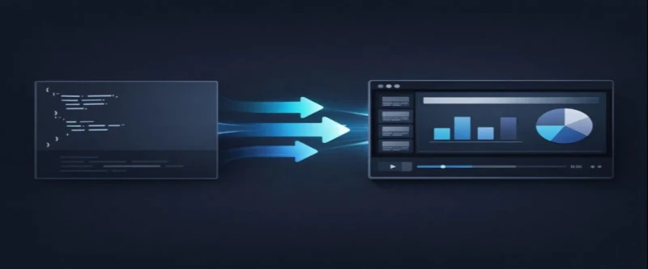

# Taleem Player



**Taleem Player** converts **Taleem JSON slide data** into **web-based presentations**.

It renders the _same taleem JSON_ in multiple ways using different display modes.

> **Stable 1.0 — API frozen.**  
> Internal improvements may continue without breaking public contracts.

---

## Demo & Documentation

👉 https://bilza2023.github.io/taleem/

The live demo shows:

- Browser Mode (index-based rendering)
- Player Mode (time-based rendering)
- Real production Taleem JSON
- Shared CSS across all modes

**No screenshots. No mock data.  
What you see is the real engine running in the browser.**

---

## Installation

```bash
npm install taleem-player
```

---

## Display Modes

### Browser Mode (Index-based)

Use when you want **direct access to slides**.

```js
import { createTaleemBrowser } from "taleem-player";

const browser = createTaleemBrowser({
  mount: "#app",
  deck,
});

browser.render(0);
browser.getTotal();
```

**Ideal for**

- previews
- galleries
- editors
- syllabus pages

---

### Player Mode (Time-based)

Use when slides must change **progressively over time**.

```js
import { createTaleemPlayer } from "taleem-player";

const player = createTaleemPlayer({ mount: "#app" });
player.renderAt(12.5);
```

**Ideal for**

- narrated lessons
- video / audio sync
- recorded presentations

---

## Browser vs Player (Quick Comparison)

| Feature         | Browser        | Player         |
| --------------- | -------------- | -------------- |
| Rendering       | Index-based    | Time-based     |
| Timing required | No             | Yes            |
| Navigation      | Manual         | Progressive    |
| Control         | App-driven     | External clock |
| Use case        | Preview / Edit | Playback       |

> ⚠️ Player Mode requires **valid, ordered timings**.
> The library does not auto-correct or guess timing errors.

---

## Utilities (Runtime-safe)

These **Utilities (Runtime-safe)** are exported :

```js
import {
  assignMockTimings,
  resolveAssetPaths,
  resolveBackground,
  getDeckEndTime,
} from "taleem-player";
```

- `assignMockTimings(deck, seconds)`
- `resolveAssetPaths(deck, basePath)`
- `resolveBackground(deck, basePath)`
- `getDeckEndTime(deck)`

These helpers prepare decks for real usage and runtime playback.

---

## CSS

```js
import "taleem-player/css";
import "taleem-player/css/dark";
import "taleem-player/css/light";
import "taleem-player/css/paper";
```

CSS must be imported explicitly by the host app.
All modes share the same styling system.

---

## What Taleem Player does NOT do

- create slides
- edit JSON
- manage clocks or media playback
- handle audio or narration
- auto-validate or repair data

Those responsibilities belong to the **application layer**.

---

## Status

**Stable — Version 1.0**

The `eq` slide type is **experimental**:
- it is implemented but intentionally limited
- it should not be relied on for production math rendering
- its behavior may evolve without breaking the core player API

---

## License

MIT
